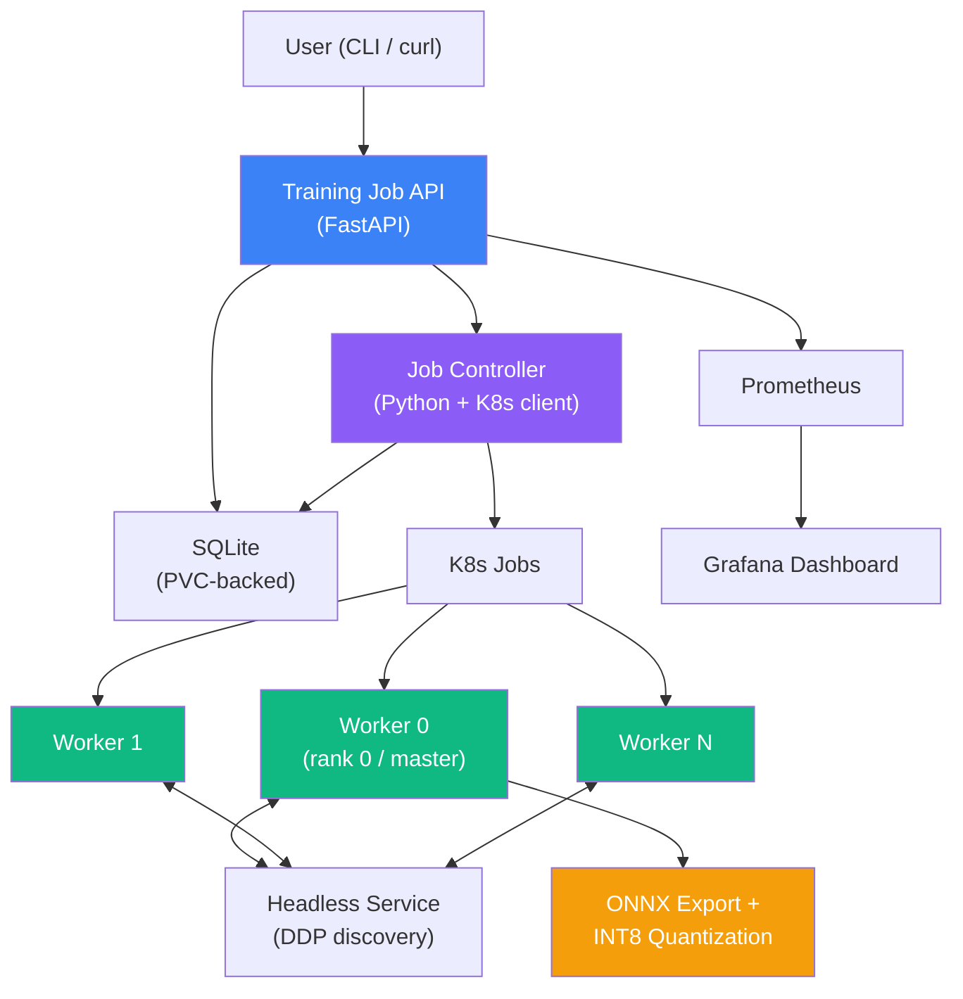

# ML Training Operator

**Kubernetes-native ML training job operator for autonomous vehicle perception models**

A platform engineering project that manages the lifecycle of distributed training jobs on Kubernetes — built with the same patterns used by ML Infrastructure teams at companies like Motional, Waymo, and Cruise. Trains on Motional's open-source [nuScenes](https://www.nuscenes.org/) autonomous vehicle dataset.

## Architecture



## Key Features

- **Job Submission API** — RESTful FastAPI with Pydantic v2 validation
- **K8s-native Scheduling** — Jobs as first-class K8s batch workloads with proper RBAC
- **Distributed Training** — PyTorch DDP with gloo backend, headless Service for worker discovery
- **Post-training Optimization** — ONNX export + INT8 quantization for edge deployment
- **Retry with Backoff** — Exponential backoff, configurable max retries, dead-letter state
- **Checkpointing** — Periodic checkpoint saving, automatic resume from latest
- **Scaling Benchmarks** — Measure throughput scaling across 1/2/4 workers
- **Monitoring** — Prometheus metrics + Grafana dashboard
- **CLI** — Rich terminal interface for job management

## Tech Stack

| Component | Technology |
|-----------|-----------|
| API | FastAPI, Pydantic v2, uvicorn |
| Controller | Python kubernetes client, structlog |
| Training | PyTorch, torchvision, PyTorch DDP |
| Optimization | ONNX, ONNX Runtime, INT8 quantization |
| Dataset | nuScenes (Motional's AV dataset) |
| Storage | SQLite via aiosqlite |
| Monitoring | Prometheus, Grafana |
| CLI | Click, Rich, httpx |
| Infrastructure | Docker, Kubernetes, Kustomize |
| CI/CD | GitHub Actions |
| Cloud | GKE (Google Kubernetes Engine) |

## Quick Start (Local)

```bash
# Clone
git clone https://github.com/lsayedla-dot/ml-training-operator.git
cd ml-training-operator

# Install
pip install -e ".[dev,worker]"

# Run tests (uses synthetic data — no nuScenes download needed)
make test

# Run the API locally
uvicorn src.api.app:app --reload

# In another terminal, submit a job
mltrain submit --name test-run --model resnet18 --epochs 5

# Run scaling benchmark with synthetic data
mltrain benchmark --max-workers 4
```

## Quick Start (GKE)

See [GKE Deployment Guide](docs/GKE_DEPLOYMENT.md) for step-by-step instructions.

```bash
# Deploy to GKE (requires gcloud CLI)
./scripts/deploy_gke.sh

# Teardown
./scripts/teardown_gke.sh
```

## CLI Usage

```bash
# Submit a single-worker job
mltrain submit --name nuscenes-v3 --model resnet18 --epochs 10 --batch-size 32

# Submit distributed training (4 workers) with post-training optimization
mltrain submit --name nuscenes-v3-dist --model resnet18 --epochs 10 --workers 4 --optimize

# List jobs
mltrain list
mltrain list --status RUNNING

# Get job details
mltrain status <job-id>

# View logs
mltrain logs <job-id>
mltrain logs <job-id> --rank 0    # Specific worker rank

# Cancel a job
mltrain cancel <job-id>

# Run local scaling benchmark
mltrain benchmark --max-workers 4
```

## API Reference

| Method | Path | Description |
|--------|------|-------------|
| `POST` | `/jobs` | Submit a new training job |
| `GET` | `/jobs` | List all jobs (optional `?status=` filter) |
| `GET` | `/jobs/{id}` | Get job details |
| `DELETE` | `/jobs/{id}` | Cancel a running job |
| `GET` | `/health` | Health check (K8s + DB connectivity) |
| `GET` | `/metrics` | Prometheus metrics endpoint |

## Project Structure

```
ml-training-operator/
├── src/
│   ├── api/           # FastAPI application (routes, models, dependencies)
│   ├── controller/    # Job manager, K8s client, job spec builder, retry logic
│   ├── worker/        # Training script, dataset, model, DDP, optimization, benchmark
│   ├── storage/       # SQLite database for job metadata
│   ├── metrics/       # Prometheus metric definitions
│   └── cli/           # Click CLI tool
├── k8s/
│   ├── base/          # Kustomize base manifests (RBAC, deployments, PVCs, Prometheus)
│   ├── overlays/      # Dev and prod overlays
│   └── worker/        # Job templates (single + distributed DDP)
├── docker/            # API and Worker Dockerfiles
├── tests/             # Unit + integration tests (40+ tests)
├── scripts/           # nuScenes download, GKE deploy/teardown
└── docs/              # Design decisions, architecture, GKE deployment guide
```

## Design Decisions

See [Design Decisions](docs/DESIGN_DECISIONS.md) for detailed rationale on:

1. Custom operator over Argo/Kubeflow
2. Kustomize over Helm
3. K8s Jobs over Deployments for training
4. SQLite over PostgreSQL
5. Controller polling over K8s Watch API
6. Controller-level retry over K8s-level retry
7. nuScenes data over synthetic/CIFAR
8. PyTorch DDP with gloo over Horovod/DeepSpeed
9. ONNX + INT8 quantization for edge deployment

## What This Demonstrates

| JD Requirement | Implementation |
|---------------|----------------|
| Design and deploy on Kubernetes | Full K8s deployment with Kustomize, RBAC, PVCs, Jobs |
| Services supporting ML lifecycle | Job submission API, training orchestration, checkpoint management |
| Distributed training at scale | PyTorch DDP with headless Service discovery, scaling benchmarks |
| Post-training optimization | ONNX export + INT8 quantization pipeline for edge deployment |
| High-quality code | Type hints, structlog, Pydantic v2, 40+ tests, CI/CD |
| End-to-end ownership | From API design to K8s manifests to GKE deployment |
| Domain expertise | Motional's nuScenes dataset, AV perception model training |

## Author

**Abhinav Yedla**
- GitHub: [@lsayedla-dot](https://github.com/lsayedla-dot)
- Email: lsayedla@gmail.com
- LinkedIn: [abhinavyedla](https://linkedin.com/in/abhinavyedla)
- Certifications: GCP Professional Data Engineer, GCP Professional ML Engineer
