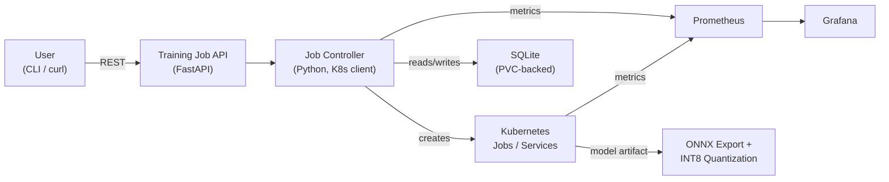
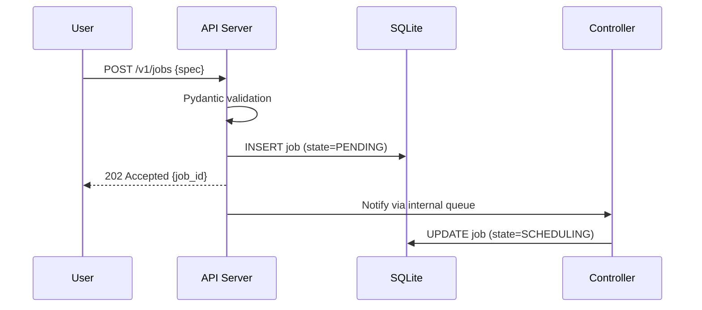
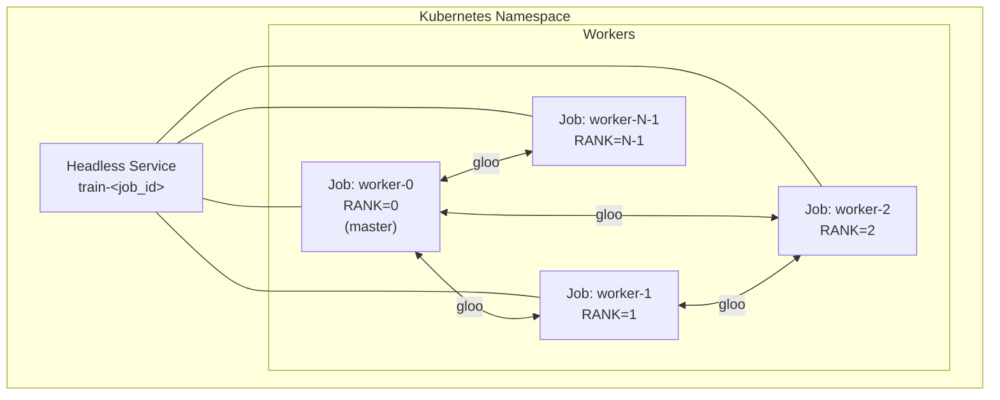
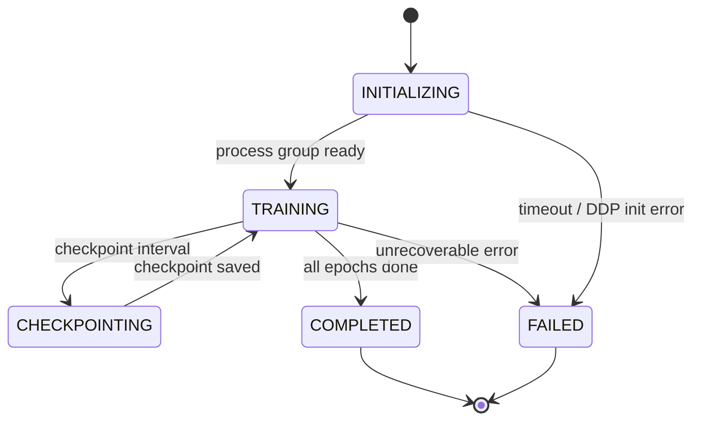
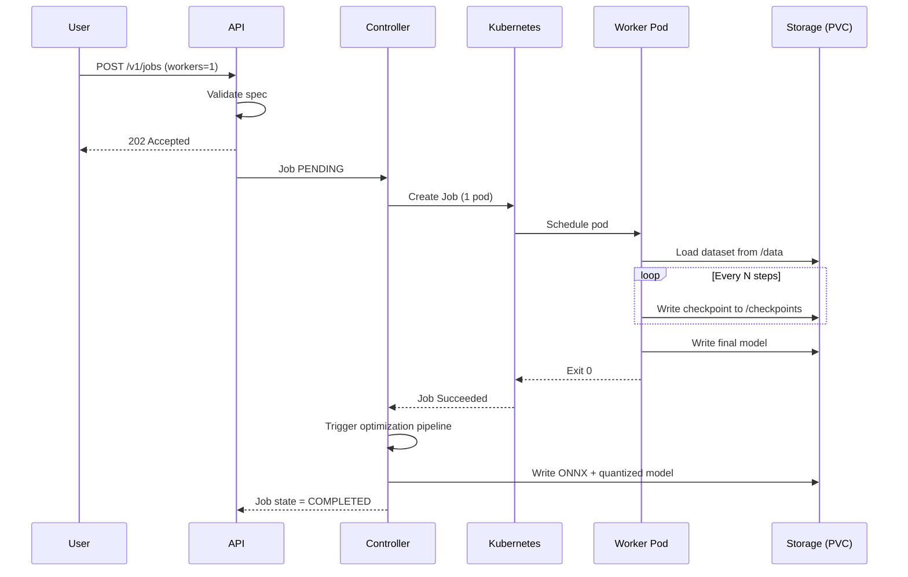
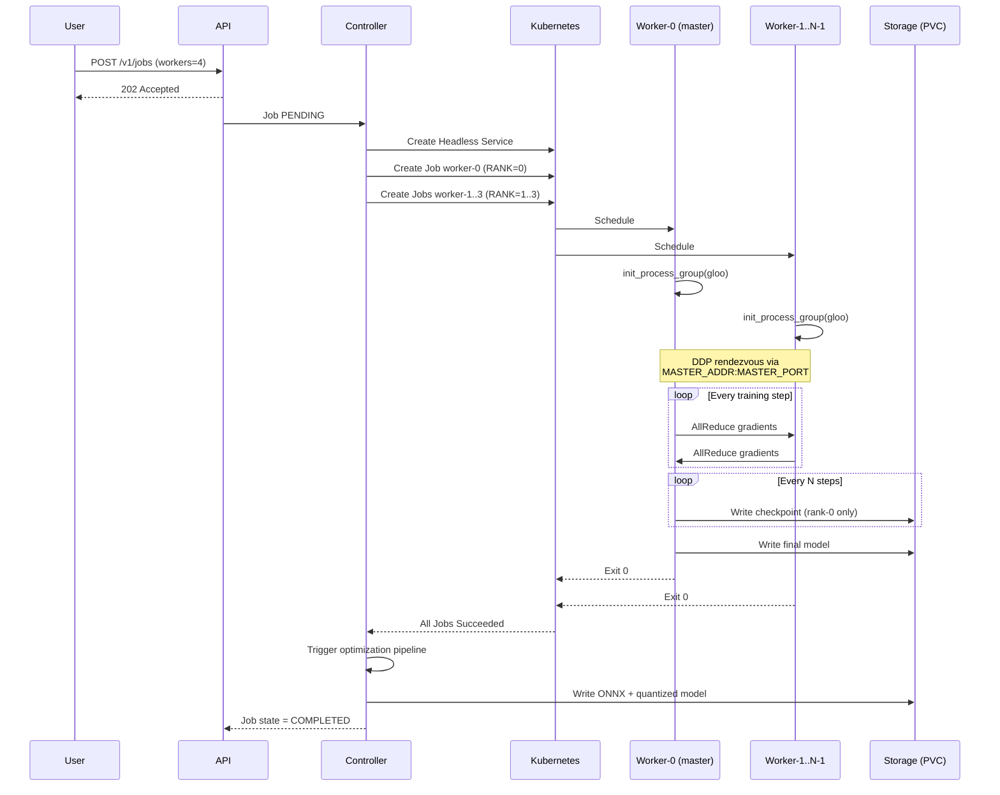
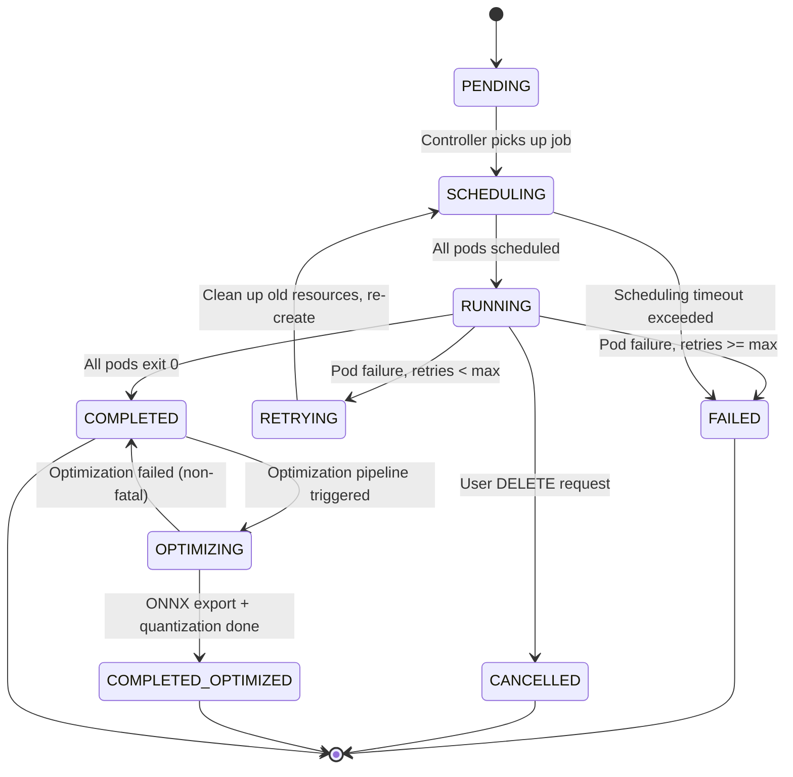
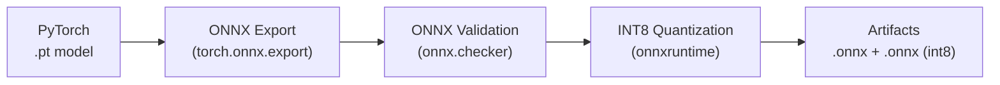

# ML Training Operator -- Architecture Deep-Dive

> Kubernetes-native ML training job manager supporting single-node and
> distributed (PyTorch DDP) workloads, with built-in observability and a
> post-training optimization pipeline.

---

## Table of Contents

1. [System Overview](#system-overview)
2. [Component Details](#component-details)
   - [Training Job API](#training-job-api)
   - [Job Controller](#job-controller)
   - [Worker Pods](#worker-pods)
   - [Storage Layer](#storage-layer)
   - [Metrics and Observability](#metrics-and-observability)
3. [Data Flow](#data-flow)
   - [Single-Node Job](#single-node-job)
   - [Distributed DDP Job](#distributed-ddp-job)
4. [Retry and Failure Handling](#retry-and-failure-handling)
5. [Checkpoint Strategy](#checkpoint-strategy)
6. [Post-Training Optimization Pipeline](#post-training-optimization-pipeline)
7. [Observability](#observability)
8. [Security](#security)

---

## System Overview

The ML Training Operator turns a single API call into a fully managed
Kubernetes training run. Users submit a job spec through the REST API (via CLI
or `curl`), the Job Controller translates it into the right set of Kubernetes
resources, and the system tracks state, retries failures, exports metrics, and
runs a post-training optimization pipeline -- all without manual `kubectl`
interaction.



### Key Design Decisions

| Decision | Rationale |
|---|---|
| FastAPI for the API layer | Async-native, automatic OpenAPI docs, Pydantic validation |
| Python `kubernetes` client in the Controller | Same language as the ML ecosystem; first-class CRD and Job support |
| SQLite on a PVC (not etcd / Postgres) | Single-writer workload; zero external dependencies; PVC gives durability |
| PyTorch DDP with `gloo` backend | CPU-friendly, no NCCL dependency for clusters without InfiniBand/NVLink; switchable to `nccl` for GPU runs |
| Headless Service for distributed jobs | Pods resolve each other by DNS without a load balancer, which DDP requires for rank-to-rank communication |
| ONNX + INT8 quantization as a built-in stage | Keeps the path from training to deployable artifact inside the same system |

---

## Component Details

### Training Job API

**Location:** `api/` directory
**Framework:** FastAPI (Python 3.11+)
**Runs as:** A Kubernetes `Deployment` with 2+ replicas behind a `ClusterIP` Service.

#### Responsibilities

- Accept job submission, cancellation, status query, and log retrieval requests.
- Validate payloads with Pydantic models (`TrainingJobSpec`).
- Write the initial job record to SQLite and enqueue the job for the Controller.
- Expose a `/healthz` endpoint for Kubernetes liveness/readiness probes.
- Serve Prometheus metrics at `/metrics`.

#### Key Endpoints

| Method | Path | Purpose |
|---|---|---|
| `POST` | `/v1/jobs` | Submit a new training job |
| `GET` | `/v1/jobs/{id}` | Get job status and metadata |
| `GET` | `/v1/jobs/{id}/logs` | Stream logs from worker pods |
| `DELETE` | `/v1/jobs/{id}` | Cancel a running job |
| `GET` | `/v1/jobs` | List jobs with filter/pagination |
| `GET` | `/v1/jobs/{id}/artifact` | Download the trained model artifact |

#### Request Lifecycle



### Job Controller

**Location:** `controller/` directory
**Runs as:** A single-replica `Deployment` (leader-elected when HA is needed).

The Controller is the brain of the operator. It watches for new job records,
creates the necessary Kubernetes resources, monitors their progress, handles
retries, and triggers post-training steps.

#### Core Loop (Reconciliation)

```
while True:
    pending_jobs = db.query(state IN (PENDING, SCHEDULING, RUNNING, RETRYING))
    for job in pending_jobs:
        reconcile(job)
    sleep(RECONCILE_INTERVAL)  # default 5 s
```

Each `reconcile(job)` call is idempotent. The controller can restart at any
point and converge back to the correct state by comparing the desired state
(SQLite) with the actual state (Kubernetes API).

#### Resource Creation -- Single Job

For a single-node job the Controller creates one Kubernetes `batch/v1 Job`:

```yaml
apiVersion: batch/v1
kind: Job
metadata:
  name: train-<job_id>
  labels:
    ml-operator/job-id: "<job_id>"
spec:
  backoffLimit: 0          # retries managed by the Controller
  template:
    spec:
      containers:
        - name: worker
          image: <user-specified-image>
          command: ["python", "-m", "worker.train"]
          env:
            - name: JOB_ID
              value: "<job_id>"
            - name: CHECKPOINT_DIR
              value: "/checkpoints"
          resources:
            requests:
              cpu: "4"
              memory: "16Gi"
            limits:
              nvidia.com/gpu: "1"   # if GPU requested
          volumeMounts:
            - name: data
              mountPath: /data
            - name: checkpoints
              mountPath: /checkpoints
      volumes:
        - name: data
          persistentVolumeClaim:
            claimName: training-data
        - name: checkpoints
          persistentVolumeClaim:
            claimName: checkpoints-<job_id>
```

#### Resource Creation -- Distributed DDP Job

For a distributed job with `N` workers, the Controller creates:

1. **One Headless Service** -- allows pods to discover each other by stable DNS
   names (`worker-0.train-<job_id>`, `worker-1.train-<job_id>`, etc.).
2. **N Kubernetes Jobs** -- one per rank, each injected with the DDP
   environment variables.



Environment variables injected into every worker pod:

| Variable | Value | Purpose |
|---|---|---|
| `MASTER_ADDR` | `worker-0.train-<job_id>` | DNS name of rank-0 pod (via Headless Service) |
| `MASTER_PORT` | `29500` (configurable) | Port for DDP rendezvous |
| `WORLD_SIZE` | `N` | Total number of workers |
| `RANK` | `0 .. N-1` | This worker's global rank |
| `JOB_ID` | `<job_id>` | Used for checkpoint and metric labeling |

The Headless Service spec:

```yaml
apiVersion: v1
kind: Service
metadata:
  name: train-<job_id>
spec:
  clusterIP: None
  selector:
    ml-operator/job-id: "<job_id>"
  ports:
    - port: 29500
      name: ddp
```

### Worker Pods

**Location:** `worker/` directory
**Runs as:** Containers inside the Kubernetes Jobs created by the Controller.

Each worker:

1. Initializes the PyTorch `distributed` process group (`gloo` backend by
   default, `nccl` when GPUs are present and the user opts in).
2. Loads the dataset shard corresponding to its rank
   (`DistributedSampler(rank=RANK, num_replicas=WORLD_SIZE)`).
3. Runs the training loop, periodically:
   - Writing checkpoints to the shared PVC.
   - Pushing metrics (loss, throughput, learning rate) to Prometheus via
     `prometheus_client`.
4. On completion, rank-0 writes the final model artifact to the output PVC.

#### Worker State Machine



### Storage Layer

#### SQLite (Job State)

- Backed by a PVC mounted into the API and Controller pods.
- Single-writer model: only the Controller writes state transitions; the API
  writes only the initial `PENDING` record.
- Schema (simplified):

```sql
CREATE TABLE jobs (
    id            TEXT PRIMARY KEY,
    spec          TEXT NOT NULL,        -- JSON blob of TrainingJobSpec
    state         TEXT NOT NULL,        -- PENDING | SCHEDULING | RUNNING | ...
    worker_count  INTEGER DEFAULT 1,
    retries       INTEGER DEFAULT 0,
    created_at    TIMESTAMP DEFAULT CURRENT_TIMESTAMP,
    updated_at    TIMESTAMP DEFAULT CURRENT_TIMESTAMP,
    error_message TEXT
);

CREATE TABLE checkpoints (
    id         TEXT PRIMARY KEY,
    job_id     TEXT NOT NULL REFERENCES jobs(id),
    epoch      INTEGER NOT NULL,
    step       INTEGER NOT NULL,
    path       TEXT NOT NULL,
    created_at TIMESTAMP DEFAULT CURRENT_TIMESTAMP
);
```

- WAL mode is enabled for concurrent readers (API serving status queries) with
  a single writer (Controller).

#### Persistent Volumes

| PVC | Mount Path | Purpose |
|---|---|---|
| `training-data` | `/data` | Shared read-only dataset |
| `checkpoints-<job_id>` | `/checkpoints` | Per-job checkpoint and model output storage |
| `operator-db` | `/var/lib/operator` | SQLite database file |

### Metrics and Observability

Covered in detail in the [Observability](#observability) section below.

---

## Data Flow

### Single-Node Job



### Distributed DDP Job



---

## Retry and Failure Handling

The Controller -- not Kubernetes -- owns retry logic. Kubernetes Job
`backoffLimit` is set to `0` so that any pod failure is immediately surfaced to
the Controller for a policy decision.

### Job State Machine



### Retry Policy

| Parameter | Default | Description |
|---|---|---|
| `max_retries` | 3 | Maximum number of retry attempts |
| `retry_delay_seconds` | 30 | Back-off delay before re-scheduling |
| `retry_on` | `[OOMKilled, Error]` | Pod failure reasons that trigger a retry |
| `checkpoint_resume` | `true` | Resume from the latest checkpoint on retry |

On retry the Controller:

1. Deletes all Kubernetes resources for the failed attempt (Jobs, Headless
   Service).
2. Waits `retry_delay_seconds`.
3. Looks up the latest checkpoint in the `checkpoints` table.
4. Re-creates resources with `RESUME_CHECKPOINT=/checkpoints/<path>` injected
   as an env var.
5. Increments the `retries` counter in SQLite.

For distributed jobs, if **any** worker fails, **all** workers are torn down
and the entire group is re-created. Partial recovery is not attempted because
DDP requires all ranks to be present for `AllReduce`.

### Failure Classification

| Category | Action |
|---|---|
| OOMKilled | Retry. If repeated, mark FAILED with guidance to increase memory. |
| Node preemption (spot) | Retry immediately (no delay). |
| Image pull error | Mark FAILED immediately (no retry). |
| DDP timeout (rendezvous) | Retry with exponential back-off. |
| User code exception | Retry up to `max_retries`, then FAILED. |

---

## Checkpoint Strategy

Checkpoints are critical for fault tolerance and cost efficiency (especially on
spot/preemptible nodes).

### How It Works

- **Frequency:** Configurable via `checkpoint_interval_steps` (default: 500
  steps) or `checkpoint_interval_minutes` (default: 15 min), whichever fires
  first.
- **Who writes:** In distributed jobs, only rank-0 writes the checkpoint. All
  ranks hit a `barrier()` before and after the save so that no worker continues
  training while the checkpoint is in flight.
- **What is saved:**
  - Model `state_dict`
  - Optimizer `state_dict`
  - Learning rate scheduler state
  - Current epoch and global step
  - RNG states (Python, NumPy, PyTorch, CUDA)
- **Where:** `/checkpoints/<job_id>/epoch-<E>-step-<S>.pt`
- **Retention:** The last `checkpoint_keep` (default: 3) checkpoints are kept;
  older ones are garbage-collected by the Controller.

### Resume Flow

```
1. Worker starts, checks RESUME_CHECKPOINT env var.
2. If set, loads checkpoint from PVC.
3. Restores model, optimizer, scheduler, RNG states.
4. Adjusts DataLoader to skip already-seen batches (via sampler offset).
5. Training continues from saved global step.
```

---

## Post-Training Optimization Pipeline

When a job reaches `COMPLETED`, the Controller spawns a short-lived Kubernetes
Job that runs the optimization pipeline:



### Steps

1. **ONNX Export** -- `torch.onnx.export` with dynamic axes for batch
   dimension. Opset version is configurable (default: 17).
2. **Validation** -- `onnx.checker.check_model` ensures the exported graph is
   well-formed.
3. **INT8 Quantization** -- `onnxruntime.quantization.quantize_dynamic` applies
   dynamic INT8 quantization targeting `Linear` and `Conv` operators. A
   calibration dataset (subset of training data) is used when static
   quantization is requested.
4. **Artifact Storage** -- Both the full-precision ONNX model and the
   quantized variant are written to the job's checkpoint PVC:
   - `/checkpoints/<job_id>/model.onnx`
   - `/checkpoints/<job_id>/model-int8.onnx`

The pipeline is **non-fatal**: if any step fails the job state moves back to
`COMPLETED` (not `FAILED`) and the error is logged. The original `.pt`
artifact is always available.

---

## Observability

### Prometheus Metrics

Metrics are exposed from two sources:

**API Server (`/metrics`)**

| Metric | Type | Description |
|---|---|---|
| `mlop_api_requests_total` | Counter | Total API requests by method, path, status |
| `mlop_api_request_duration_seconds` | Histogram | Request latency by endpoint |
| `mlop_jobs_submitted_total` | Counter | Jobs submitted by type (single/distributed) |

**Worker Pods (push via Prometheus Pushgateway)**

| Metric | Type | Description |
|---|---|---|
| `mlop_training_loss` | Gauge | Current training loss, labeled by job_id, rank |
| `mlop_training_throughput_samples_per_sec` | Gauge | Training throughput |
| `mlop_training_epoch` | Gauge | Current epoch |
| `mlop_training_step` | Gauge | Current global step |
| `mlop_training_learning_rate` | Gauge | Current learning rate |
| `mlop_checkpoint_duration_seconds` | Histogram | Time to write a checkpoint |
| `mlop_gpu_utilization_percent` | Gauge | GPU utilization (if available) |

**Controller**

| Metric | Type | Description |
|---|---|---|
| `mlop_controller_reconcile_duration_seconds` | Histogram | Reconcile loop latency |
| `mlop_jobs_by_state` | Gauge | Number of jobs in each state |
| `mlop_job_retries_total` | Counter | Total retries across all jobs |
| `mlop_optimization_pipeline_duration_seconds` | Histogram | ONNX export + quantization time |

### Grafana Dashboard

A pre-built dashboard (`deploy/grafana/dashboard.json`) provides:

- **Cluster view:** Jobs by state over time, queue depth, retry rate.
- **Job detail view:** Loss curve, throughput, learning rate schedule, GPU
  utilization, checkpoint timeline.
- **Infrastructure view:** Pod resource usage, PVC capacity, API latency
  percentiles.

### Structured Logging

All components emit JSON-structured logs with the fields:

```json
{
  "ts": "2026-03-22T14:05:12Z",
  "level": "info",
  "component": "controller",
  "job_id": "abc-123",
  "msg": "All workers running",
  "worker_count": 4
}
```

Logs are collected by the cluster's standard log pipeline (e.g., Fluent Bit to
Loki or Elasticsearch).

---

## Security

### RBAC -- Least Privilege

Each component runs with a dedicated Kubernetes `ServiceAccount` scoped to the
minimum permissions it needs.

**API Server ServiceAccount**

```yaml
rules:
  - apiGroups: [""]
    resources: ["pods/log"]
    verbs: ["get"]          # for log streaming only
```

The API server talks to SQLite for job management -- it does **not** need
permission to create or delete Kubernetes Jobs.

**Controller ServiceAccount**

```yaml
rules:
  - apiGroups: ["batch"]
    resources: ["jobs"]
    verbs: ["create", "get", "list", "watch", "delete"]
  - apiGroups: [""]
    resources: ["services"]
    verbs: ["create", "get", "delete"]      # headless services for DDP
  - apiGroups: [""]
    resources: ["pods"]
    verbs: ["get", "list", "watch"]         # monitor pod status
  - apiGroups: [""]
    resources: ["persistentvolumeclaims"]
    verbs: ["create", "get", "delete"]      # per-job checkpoint PVCs
```

**Worker Pods ServiceAccount**

```yaml
rules: []   # no Kubernetes API access needed
```

Workers interact only with the filesystem (PVCs) and the network (DDP, Prometheus Pushgateway). They have zero Kubernetes API permissions.

### Network Policy

```yaml
apiVersion: networking.k8s.io/v1
kind: NetworkPolicy
metadata:
  name: training-workers
spec:
  podSelector:
    matchLabels:
      ml-operator/role: worker
  policyTypes: ["Ingress", "Egress"]
  ingress:
    - from:
        - podSelector:
            matchLabels:
              ml-operator/role: worker   # DDP peer traffic only
      ports:
        - port: 29500
  egress:
    - to:
        - podSelector:
            matchLabels:
              ml-operator/role: worker   # DDP peers
      ports:
        - port: 29500
    - to:
        - namespaceSelector: {}
          podSelector:
            matchLabels:
              app: prometheus-pushgateway  # metrics push
      ports:
        - port: 9091
```

Workers can talk only to each other (for DDP) and to the Prometheus Pushgateway.
All other egress is denied.

### Additional Hardening

| Measure | Implementation |
|---|---|
| Read-only root filesystem | `securityContext.readOnlyRootFilesystem: true` on all containers; writable paths via `emptyDir` or PVC mounts only |
| Non-root execution | `runAsNonRoot: true`, `runAsUser: 1000` |
| No privilege escalation | `allowPrivilegeEscalation: false` |
| Image pinning | All operator images referenced by digest, not mutable tags |
| Secret management | Training secrets (API keys, S3 credentials) injected via Kubernetes Secrets mounted as files, never as env vars |
| API authentication | Bearer token validation middleware in FastAPI; tokens issued by the cluster's identity provider |

---

## Appendix: Directory Layout

```
ml-training-operator/
  api/                  # FastAPI application
    main.py
    models.py           # Pydantic schemas
    routes.py
    middleware.py        # auth, metrics
  controller/           # Job Controller
    main.py
    reconciler.py
    k8s_resources.py    # Job/Service template builders
    optimizer.py        # ONNX export + quantization trigger
  worker/               # Training worker entrypoint
    train.py
    checkpoint.py
    metrics.py          # Prometheus push
  deploy/               # Kubernetes manifests
    base/               # Kustomize base
    overlays/           # dev / staging / prod
    grafana/
      dashboard.json
  tests/
  docs/
    ARCHITECTURE.md     # (this document)
```
